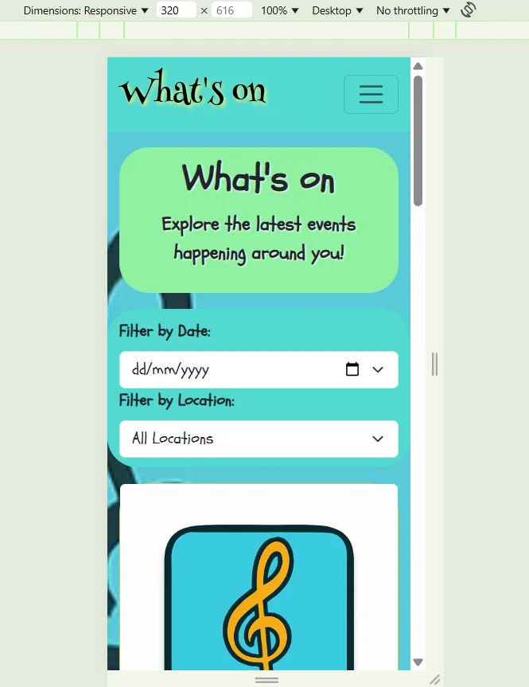

# User Stories

## Epic 1

### User Profile Page

User Profile Page GitHub User Story

 
The link below will take you to the issue created for the User profile page.
 

https://github.com/chloejones9464/whats-on/issues/4

 

Mobile(320px)

### Mobile (320px)

 

Tablet

### Tablet

 

Laptop

### Laptop

 

1080p Screen

### 1080p screen

### Returning User

Returning User GitHub User Story

 
The link below will take you to the issue created for the Returning User user story. The screenshots below show the alert users will get if they do not have a log in. If they have a log in, the screen will take them to the event list of the site.
 

https://github.com/chloejones9464/whats-on/issues/3

 

Mobile(320px)

### Mobile (320px)

 

Tablet

### Tablet

 

Laptop

### Laptop

 

1080p Screen

### 1080p screen

### Signing up

Signing up GitHub User Story

 
The link below will take you to the issue created for the Signing up user story.
 

https://github.com/chloejones9464/whats-on/issues/2

 

Mobile(320px)

### Mobile (320px)

 

Tablet

### Tablet

 

Laptop

### Laptop

 

1080p Screen

### 1080p screen

## Epic 2

### Create a new event

Create a new event GitHub User Story

 
The link below will take you to the issue created for the Create a new event user story.
 

https://github.com/chloejones9464/whats-on/issues/5

 

Mobile(320px)

### Mobile (320px)

 

Tablet

### Tablet

 

Laptop

### Laptop

 

1080p Screen

### 1080p screen

### Editing events

Editing events GitHub User Story

 
The link below will take you to the issue created for the Editing events user story.
 

https://github.com/chloejones9464/whats-on/issues/7

 

Mobile(320px)

### Mobile (320px)

 

Tablet

### Tablet

 

Laptop

### Laptop

 

1080p Screen

### 1080p screen
 **need to sort the description section

### Deleting events

Deleting events GitHub User Story

 
The link below will take you to the issue created for the Deleting events user story.
 

https://github.com/chloejones9464/whats-on/issues/8

 

Mobile(320px)

### Mobile (320px)

 

Tablet

### Tablet

 

Laptop

### Laptop

 

1080p Screen

### 1080p screen

## Epic 3

### List of upcoming events

List of upcoming events and filter function GitHub User Story

 
The link below will take you to the issue created for the List of upcoming events and filter function user story.
 

## List of upcoming events
https://github.com/chloejones9464/whats-on/issues/10

## Filter function
https://github.com/chloejones9464/whats-on/issues/11

 

Mobile(320px)

### Mobile (320px)

 

Tablet

### Tablet

 

Laptop

### Laptop

 

1080p Screen

### 1080p screen

### Details of the events

Details of the events GitHub User Story

 
The link below will take you to the issue created for the Details of the events user story.
 

https://github.com/chloejones9464/whats-on/issues/12

 

Mobile(320px)

### Mobile (320px)

 

Tablet

### Tablet

 

Laptop

### Laptop

 

1080p Screen

### 1080p screen

### Past events filter

Past events filter GitHub User Story

 
The link below will take you to the issue created for the Past events filter user story.
 

https://github.com/chloejones9464/whats-on/issues/13

## Epic 4

### Commenting on events

Commenting on events and Timestamps visible on comments GitHub User Story

 
The link below will take you to the issue created for the Commenting on events Timestamps visible on comments user stories.

The mobile section of this user story also displays the edit and delete function of the comments.
 

#### Edit and delete GitHub US
https://github.com/chloejones9464/whats-on/issues/15
 

#### Commenting on events GitHub US
https://github.com/chloejones9464/whats-on/issues/14

#### Timestamps visible on comments GitHub US
https://github.com/chloejones9464/whats-on/issues/17

 

Mobile(320px)

### Mobile (320px)

 

Tablet

### Tablet

 

Laptop

### Laptop

 

1080p Screen

### 1080p screen

### Superuser control in case of inappropriate comments

Superuser control in case of inappropriate comments GitHub User Story

 
The link below will take you to the issue created for the Superuser control in case of inappropriate comments user story.
 

https://github.com/chloejones9464/whats-on/issues/16

[Home (User Stories)](README.md#user-stories)  
[Home (Responsiveness)](README.md#responsiveness)