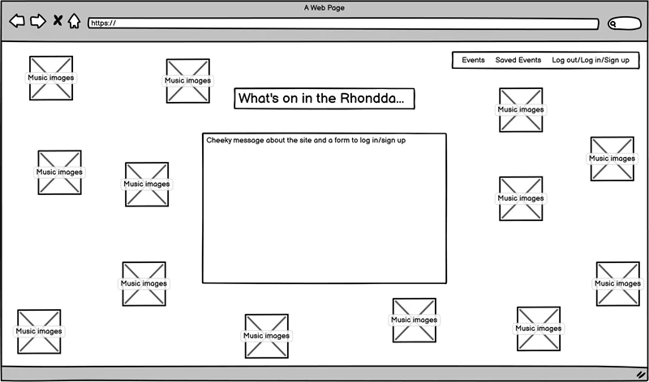

# Wireframes

#### Below you'll see I've created the frames that follow the same structure, I've used the base.html that is used throughout the project.
#### I've ensured, in these wireframe, to keep accessibility in mind so that the pages are clear and functional. Each button is designed for clear reading and understanding. My main aim for this site if for people to be able to search or browse events in the area with little to no difficulty.

## Mobile

Mobile Wireframes

## Tablet

Tablet Wireframes

Tablet Login/Signup page

Tablet Events view page

Tablet Edit/Delete page

Tablet Saved events page

Tablet Create an event page

## Desktop

Desktop Wireframes

Desktop Login/Signup page

Desktop Events view page

Desktop Edit/Delete page

Desktop Saved events page

Desktop Create an event page

 

[Home (Wireframes)](README.md#wireframes)